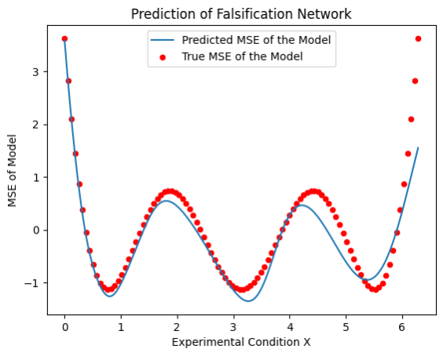

# Falsification Sampler

The falsification sampler identifies novel experimental conditions $X'$ under 
which the loss $\hat{\mathcal{L}}(M,X,Y,X')$ of the best 
candidate model is predicted to be the highest. This loss is 
approximated with a multi-layer perceptron, which is trained to 
predict the loss of a candidate model, $M$, given experiment 
conditions $X$  and dependent measures $Y$ that have already been probed:

$$
\underset{X'}{argmax}~\hat{\mathcal{L}}(M,X,Y,X').
$$


## Example

To illustrate the falsification strategy, consider a dataset representing the sine function:

$$
f(X) = \sin(X).
$$

The dataset consists of 100 data points ranging from $X=0$ to $X=2\pi$.

In addition, let's consider a linear regression as a model ($M$) of the data. 

The following figure illustrates the prediction of the fitted linear regression
(shown in blue) for the pre-collected sine dataset (conditions $X$ and observations $Y$; shown in red):


One can observe that the linear regression is a poor fit for the sine data, in particular for regions around the 
extrema of the sine function, as well as the lower and upper bounds of the domain.

The figure below shows the mean-squared error (MSE) of the linear regression 
as a function of the input $X$ (red dots):



The falsification sampler attempts to predict the MSE of the linear regression using a neural network (shown in blue).

Once the falsiifcaiton sampler has been trained, it can be used to sample novel experimental conditions $X'$ 
that are predicted to maximize the predicted MSE, such as at the boundaries of the domain, 
as well as around the extrema of the sine function. For instance, consider the following pool of candidate conditions:


| $X$ | 
|-----|
| 0   | 
| 0.5 | 
| 1   |
| 1.5 |
| 2   |
| 2.5 |
| 3   |
| 3.5 |
| 4   |
| 4.5 |
| 5   |
| 5.5 |
| 6   |
| 6.5 |

An example output of the falsification sampler is:

````
[[0. ]
 [6.5]
 [6. ]
 [2. ]]
````

The selected conditons are predicted to yield the highest error from for the linear regression model. 

### Example Code
```python
import numpy as np
from sklearn.linear_model import LinearRegression
from autora.variable import DV, IV, ValueType, VariableCollection
from autora.experimentalist.sampler.falsification import falsification_sampler
from autora.experimentalist.sampler.falsification import falsification_score_sampler

# Specify X and Y
X = np.linspace(0, 2 * np.pi, 100)
Y = np.sin(X)
X_prime = np.linspace(0, 6.5, 14)

# We need to provide the pooler with some metadata specifying the independent and dependent variables
# Specify independent variable
iv = IV(
    name="x",
    value_range=(0, 2 * np.pi),
)

# specify dependent variable
dv = DV(
    name="y",
    type=ValueType.REAL,
)

# Variable collection with ivs and dvs
metadata = VariableCollection(
    independent_variables=[iv],
    dependent_variables=[dv],
)

# Fit a linear regression to the data
model = LinearRegression()
model.fit(X.reshape(-1, 1), Y)

# Sample four novel conditions
X_selected = falsification_sampler(
    condition_pool=X_prime,
    model=model,
    reference_conditions=X,
    reference_observations=Y,
    metadata=metadata,
    num_samples=4,
)

# convert Iterable to numpy array
X_selected = np.array(list(X_selected))

print(X_selected)

# We may also obtain samples along with their z-scored novelty scores
X_selected, scores = falsification_score_sampler(
    condition_pool=X_prime,
    model=model,
    reference_conditions=X,
    reference_observations=Y,
    metadata=metadata,
    num_samples=4)
```

Output:
````
[[0. ]
 [6.5]
 [6. ]
 [2. ]]
````

